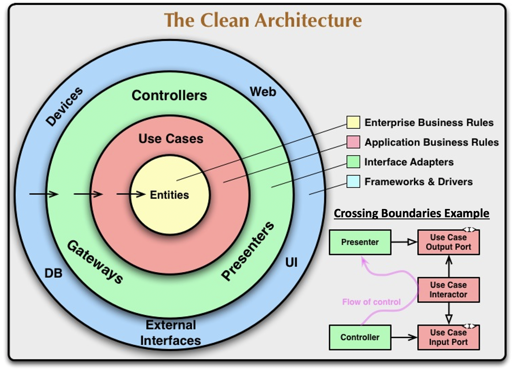
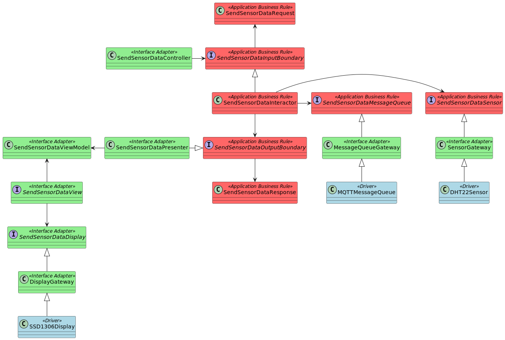
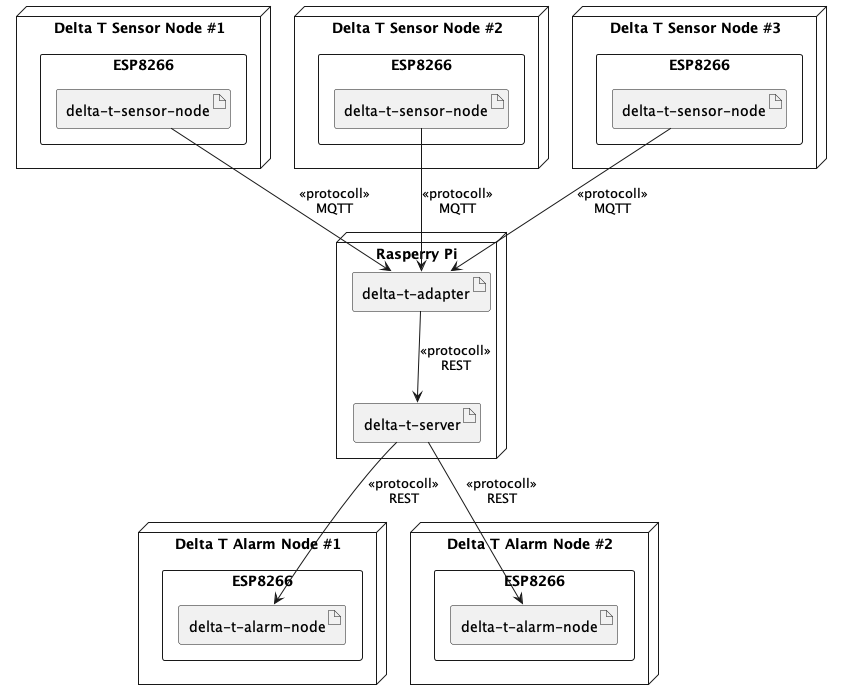

## Delta T Sensor Node

This experimental project is about applying [clean architecture](https://github.com/r42sys/clean-architecture) to an IoT
code base. Not because it's easy but because it's hard ;).

The hardware setup is quite simple: An ESP8266, a DHT22 sensor and an Adafruit SSD1306 OLED display.

Every few seconds the firmware on the ESP8266 reads temperature and relative humidity from the attached DHT22 sensor, 
shows the data on the display and publishes the data via MQTT on a temperature and a relative humidity topic.

## Architecture

## Code

**lib/facades**

Convenience code to execute the "Send Sensor Data" use-case.

**lib/drivers**

Code to access hardware and network, e.g. DHT22 sensor, Serial line, SSD1306 display, MQTT message queue, and WLAN 
network interface (blue layer in the clean architecture figure).

**lib/interface_adapters**

Code for "Send Sensor Data" presenter, view-model, and controller (green layer in the clean architecture figure) and 
gateway APIs.

**lib/application_business_rules**

Code for "Send Sensor Data" interactor (red layer in the clean architecture figure).

Actually there are no enterprise business rules.

## Class Diagram

The class color code corresponds to the colors of the clean architecture layers.

## Example Deployment

<!--
- **delta-t-sensor-node** reads temperature and humidity data from a sensor and publishes the data on MQTT message queue topics
- **delta-t-adapter** subscribes on MQTT message queue topics and forwards data via REST API
- **delta-t-server** gets sensor data via REST API and starts/stops alarm via REST API
- **delta-t-alarm-node** gets commands to start/stop alarms via REST API
-->

In this example the firmwares for the sensor (**delta-t-sensor-node**) and alarm (**delta-t-alarm-node**) hardware 
components are deployed on ESP8266 microchips. The adapter (**delta-t-adapter**) and server (**delta-t-server**)
are deployed on a Raspberry Pi.

## Build

Copy `include/config.h.in` to `include/config.h` and edit it to your needs. Then start the build process, e.g. by
executing `pio run` in the project directory.

